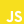

<h3 align="center">🔥 Welcome to my GitHub Page 🔥</h3>

<strong>Alireza Moradi</strong>

&nbsp;
<h3>💫 About Me :</h3>

  Hey 👋 I'm a front-end developer who loves crafting awesome user experiences with React. 
  I enjoy turning simple ideas into real, functional web apps that actually <b>feel</b> great to use. 
  Always learning, always building — currently diving deeper into React and TypeScript ⚡  

  If you're into web dev too, let's connect and geek out together 😉

<h3>🚀 What I'm up to :</h3>

  🧑‍💻 Currently working on a <b>Remote Project</b> 
  🌱 Currently learning deeper in <b>React/Next with TypeScript</b> 
  🤝 Got stuck on something? <b>Let's team up and fix it together!</b>

<h3>✨ Find Me Here :</h3>

  &nbsp;
  &nbsp;
  &nbsp;

<h3>🛠️Tech & Tools I Work With :</h3>

  &nbsp;&nbsp;
  &nbsp;&nbsp;
  &nbsp;&nbsp;
  &nbsp;&nbsp;
  &nbsp;&nbsp;
  &nbsp;&nbsp;
  &nbsp;&nbsp;
  &nbsp;&nbsp;
  &nbsp;&nbsp;
  &nbsp;&nbsp;
  &nbsp;&nbsp;
  &nbsp;&nbsp;

  &nbsp;&nbsp;
  &nbsp;&nbsp;
  &nbsp;&nbsp;
  &nbsp;&nbsp;
  &nbsp;&nbsp;
  &nbsp;&nbsp;
  &nbsp;&nbsp;

  &nbsp;&nbsp;
  &nbsp;&nbsp;
  &nbsp;&nbsp;
  &nbsp;&nbsp;
  &nbsp;&nbsp;
  &nbsp;&nbsp;
  &nbsp;&nbsp;
  &nbsp;&nbsp;

 

  &nbsp;&nbsp;
  

