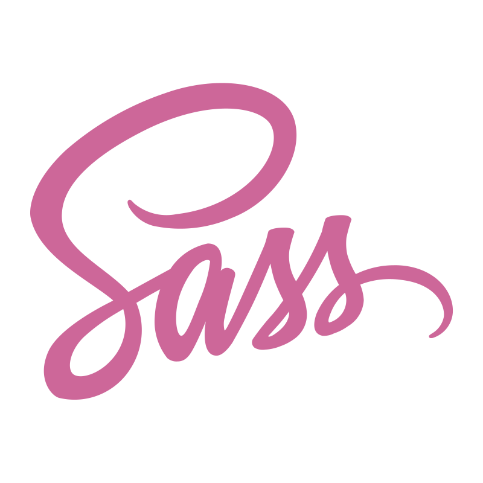
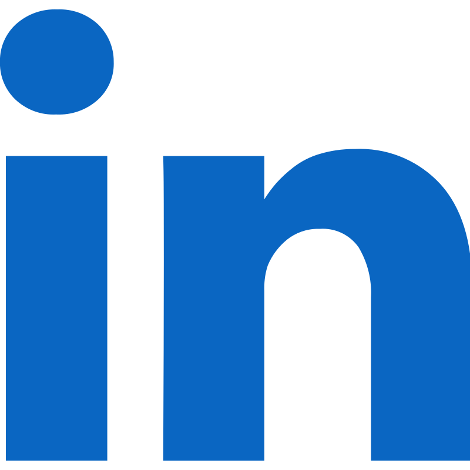

<h1 align="center">Welcome to my GitHub</h1>

<b>👋 Hi there, I'm Alireza Moradi a passionate FullStack JavaScript Developer From Iran.
</b>

<ul>
  <li>
    ⚒️ I'm currently working on <a href="">this project</a>
  </li>
  <li>
    🪴 I'm currently learning   <b>TailwindCss</b>
  </li>
  <li>
    ✨ If you have a problem in web development with <b>JS</b>, I'd be happy to help you
  </li>
  <li>
    ⚡Be your best self
  </li>
</ul>

<h3>💎 My Experiences</h3>

<h3>🏆 My Gtihub Stats</h3>

<h3>🔗 Connect with me</h3>

